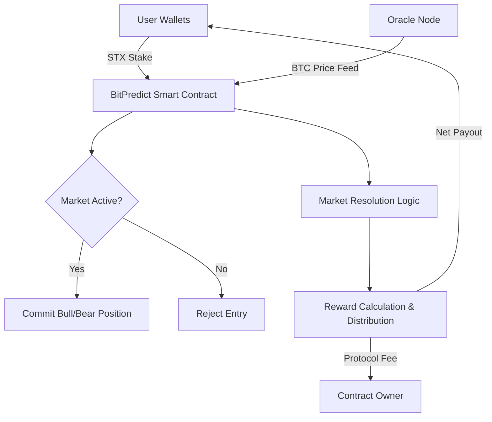

# BitPredict

**BitPredict** is a decentralized, trustless Bitcoin price prediction market protocol built on the Stacks L2, enabling non-custodial speculation, hedging, and derivative exposure to BTC/USD movements using smart contracts and verifiable oracle data.

## 🧠 Overview

BitPredict allows users to take "bull" or "bear" positions on Bitcoin's price action within permissionless market windows. It uses Bitcoin-native settlement logic and programmable oracles to ensure trust-minimized, transparent outcomes. All transactions are non-custodial, with funds remaining under user control until resolution.

## ✨ Key Features

* **Decentralized Market Creation:** Anyone can initiate BTC price prediction windows with custom parameters.
* **Non-Custodial Positions:** STX-collateralized positions are held in smart contracts, preserving user sovereignty.
* **Oracle-Based Resolution:** Markets are settled based on Bitcoin price data fed by a designated oracle.
* **Automated Payouts:** Reward distribution is computed on-chain, including protocol fee deductions.
* **Transparent & Auditable:** Every market, commitment, and claim is logged and verifiable on-chain.

## 📊 Core Architecture

* **Smart Contract** manages all market logic, balances, and claims.
* **Oracle** is the only authorized party to finalize market outcomes based on BTC/USD prices.
* **Users** interact via wallet interfaces, committing STX to markets and claiming rewards post-resolution.

## 🔐 Compliance-Oriented Design

* **No synthetic assets:** All payouts are in STX; no off-chain derivatives involved.
* **Bitcoin-denominated logic:** Market outcomes hinge on BTC/USD pricing, not token speculation.
* **Non-custodial:** The contract never assumes full custody—users maintain ownership of funds until resolved.
* **Audit-friendly:** On-chain data provides a complete record for regulators or third-party audits.

## ⚙️ Contract Functions

### ✅ Public Calls

* `create-market(opening-price, activation-block, expiration-block)`
  Owner-only: Creates a new prediction market.

* `take-position(market-id, "bull"/"bear", stake)`
  Users take long/short positions with STX.

* `settle-market(market-id, closing-price)`
  Oracle-only: Finalizes outcome with BTC/USD close price.

* `claim-rewards(market-id)`
  Users claim STX rewards after market settlement.

### 🔧 Admin Functions

* `update-oracle(new-oracle)`
  Sets a new oracle address (owner-only).

* `adjust-minimum-stake(new-minimum)`
  Updates the minimum STX stake amount (owner-only).

### 📖 Read-Only

* `get-market-data(market-id)`
  Fetch full details of a market.

* `get-user-position(market-id, user)`
  Retrieve a user’s position data.

* `get-contract-balance()`
  See total STX held by the contract.

* `get-protocol-config()`
  Returns oracle address, fee rate, and other parameters.

## 📌 Constants

* **Minimum Stake:** 1.0 STX (default)
* **Protocol Fee:** 2% of winnings
* **Error Codes:** `ERR-OWNER-ONLY`, `ERR-MARKET-CLOSED`, `ERR-INVALID-PREDICTION`, etc.

## 🧪 Example Flow

1. **Market Creation:** Admin calls `create-market(...)` with BTC opening price.
2. **Participation:** Users call `take-position(...)` before expiration.
3. **Resolution:** Oracle calls `settle-market(...)` after market expiry.
4. **Claims:** Winning users invoke `claim-rewards(...)` for payout.

## 🛠 Deployment Notes

* Deploy on **Stacks 2.1+ compatible chain**
* Oracle must be a trusted data provider for BTC/USD price at market close
* Contracts assume `tx-sender` semantics for secure role enforcement
